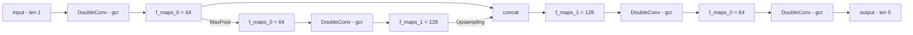

# CLAUDE.md

This file provides guidance to Claude Code (claude.ai/code) when working with code in this repository.

## Project Overview

This repository contains a Xilinx Vitis HLS implementation of a 3D U-Net with reduced contraction path for efficient FPGA acceleration as part of the DarkSHINE experiment trigger system. The project converts PyTorch neural network models to HLS-optimized C++ code for FPGA deployment.

## Key Commands

### Python Scripts
- `python3 analyze_checkpoints.py` - Analyze PyTorch checkpoint files and display weight information
- `python3 convert_weights.py` - Convert PyTorch model weights to HLS-compatible C++ format

### HLS Development
- HLS project configuration is in `hls_component/hls_config.cfg`
- Target FPGA part: `xczu15eg-ffvb1156-2-i` (Zynq UltraScale+)
- Main HLS source files are in `hls_component/`:
  - `unet3d_reduced.cpp` - Main U-Net implementation
  - `unet3d_reduced.h` - Network configuration and function declarations
  - `testbench.cpp` - HLS testbench
  - `unet_weights_data.cpp` - Converted weight data (auto-generated)
  - `unet_weights.h` - Weight declarations

## Architecture

### U-Net Network Structure
The reduced U-Net follows this architecture:
```
input(1) → DoubleConv (gcr) → f_maps[0]=64 ────── concat ─────→ f_maps[1]=128 → DoubleConv (gcr) → f_maps[0]=64 → DoubleConv (gcr) → output(5)
                                   │                                  ↑
                                MaxPool                           Upsampling
                                   ↓                                  │
                               f_maps[0]=64 → DoubleConv (gcr) → f_maps[1]=128
```



### Key Configuration Parameters
- Input dimensions: 32x32x32 (configurable via #defines in header)
- Feature maps: [64, 128] channels
- Input channels: 1, Output channels: 2 (segmentation classes)
- Convolution: 3x3x3 kernels, padding=1, stride=1
- Pooling: 2x2x2 max pooling, stride=2

### Code Structure
- `hls_component/` - Main HLS implementation and generated project files
- `hls_example/` - Template and example HLS code
- `convert_weights.py` - PyTorch to HLS weight conversion pipeline
- `analyze_checkpoints.py` - Utility for examining PyTorch model checkpoints

### Weight Conversion Pipeline
1. PyTorch checkpoints are stored as `.pth` files for each network block
2. `convert_weights.py` loads checkpoints and extracts weights/biases
3. Weights are converted to fixed-point format and written to C++ arrays
4. Generated files: `unet_weights_data.cpp` and `unet_weights.h`

### HLS-Specific Considerations
- Uses Xilinx HLS pragmas for optimization
- Fixed-point arithmetic with `ap_fixed` types
- Memory management optimized for FPGA resources
- Streaming interfaces with `hls_stream` for data flow